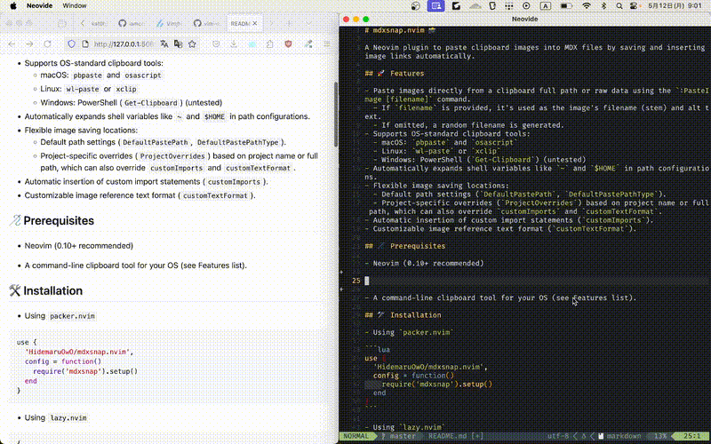
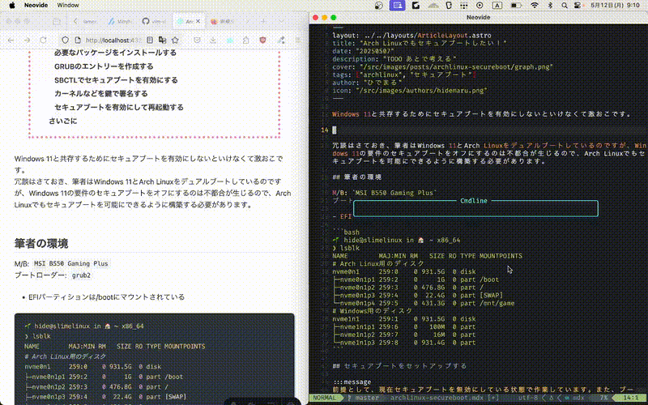

# mdxsnap.nvim 📸

A Neovim plugin to paste clipboard images into markdown and MDX files by saving and inserting image links automatically.

<details open>
<summary>Snapping markdown file</summary>



</details>

<details open>
<summary>Snapping mdx file</summary>



</details>

## 🚀 Features

- Paste images directly from a clipboard full path or raw data using the `:PasteImage [filename]` command.
  - If `filename` is provided, it's used as the image's filename (stem) and alt text.
  - If omitted, a random filename is generated.
- Supports OS-standard clipboard tools:
  - macOS: `pbpaste` and `osascript`
  - Linux: `wl-paste` or `xclip`
  - Windows: PowerShell (`Get-Clipboard`) (untested)
- Automatically expands shell variables like `~` and `$HOME` in path configurations.
- Flexible image saving locations:
  - Default path settings (`DefaultPastePath`, `DefaultPastePathType`).
  - Project-specific overrides (`ProjectOverrides`) based on project name or full path, which can also override `customImports` and `customTextFormat`.
- Automatic insertion of custom import statements (`customImports`).
- Customizable image reference text format (`customTextFormat`).

## 🪡 Prerequisites

- Neovim (0.10+ recommended)
- A command-line clipboard tool for your OS (see Features list).

## 🛠 Installation

- Using `packer.nvim`

```lua
use {
  'HidemaruOwO/mdxsnap.nvim',
  config = function()
    require('mdxsnap').setup()
  end
}
```

- Using `lazy.nvim`

```lua
{
  'HidemaruOwO/mdxsnap.nvim',
  config = function()
    require('mdxsnap').setup()
  end
}
```

## 🎯 Usage

1.  Open an MDX/Markdown file.
2.  Copy the full absolute path of an image file to your system clipboard.
3.  In Neovim (normal mode), run:
    ```vim
    :PasteImage
    ```
    - With file name
    ```vim
    :PasteImage [filename]
    ```
4.  The plugin will:
    - Copy the image to the configured directory (e.g., `project_root/snaps/images/posts/your_doc_name/random_img.png`).
    - Add necessary import statements (if configured via `customImports`).
    - Insert an image reference at your cursor (formatted by `customTextFormat`).
    - Show a success notification.

## 🔧 Configuration

Configure `mdxsnap.nvim` by calling the `setup` function. Here's an example with explanations:

```lua
-- In your Neovim configuration (e.g., init.lua or a dedicated plugins file)
require("mdxsnap").setup({
  -- Default path for saving images.
  -- If DefaultPastePathType is "relative", this is relative to the project root.
  -- If "absolute", this is used as an absolute path.
  DefaultPastePath = "snaps/images/posts", -- Default: "snaps/images/posts"
  DefaultPastePathType = "relative",               -- Default: "relative" ("absolute" is also an option)

  -- Global custom import statements to ensure are present in the file (can be overridden by ProjectOverrides).
  -- The plugin checks if an import matching `checkRegex` exists before adding `line`.
  customImports = {
    {
      line = 'import { Image } from "astro:assets";', -- The full import line
      checkRegex = 'astro:assets',                   -- A string/regex to check for existing import
    },
    -- Example:
    -- { line = 'import MyCustomImage from "@/components/MyCustomImage.astro";', checkRegex = '@/components/MyCustomImage.astro' },
  },

  -- Global format for the inserted image reference text (can be overridden by ProjectOverrides).
  -- `%s` is a placeholder.
  -- - If one `%s`: it's replaced by the image path.
  -- - If two `%s`: the first is replaced by alt text (filename stem of the new image, or the name provided to :PasteImage),
  --                 and the second by the image path.
  customTextFormat = "", -- Default: Markdown image format ""
  -- Example for Astro <Image /> component:
  -- customTextFormat = '<Image alt="%s" src={"%s"} />',
  -- Example for a simple  tag:
  -- customTextFormat = '',

  -- Override default settings for specific projects.
  -- Rules are evaluated in order; the first match is used.
  ProjectOverrides = {
    -- Example 1: Match by project directory name
    {
      matchType = "projectName",             -- "projectName" or "projectPath"
      matchValue = "my-astro-blog",        -- The name of the project's root directory
      PastePath = "src/assets/blog-images", -- Custom path for this project
      PastePathType = "relative",
      customImports = { -- Override global customImports for this project
        { line = 'import { BlogImage } from "@/components/BlogImage.astro";', checkRegex = "@/components/BlogImage.astro" },
      },
      customTextFormat = '<BlogImage alt="%s" src="%s" />', -- Override global customTextFormat
    },
    -- Example 2: Match by project's absolute path (supports ~ and $HOME)
    {
      matchType = "projectPath",
      matchValue = "~/dev/personal-website",
      PastePath = "src/content/assets/images",
      PastePathType = "relative",
      customTextFormat = "", -- Add a title to markdown images
    },
    -- Add more rules as needed
  },
})
```

**Key Configuration Options:**

- `DefaultPastePath` (string): Default directory for saving images. Initial default is `"snaps/images/posts"`.
- `DefaultPastePathType` (string): How `DefaultPastePath` is interpreted. Can be `"relative"` (to project root) or `"absolute"`. Initial default is `"relative"`.
- `ProjectOverrides` (table of tables): A list of rules to override default settings for specific projects.
  - `matchType` (string): `"projectName"` (matches the project root's directory name) or `"projectPath"` (matches the project root's absolute path, supports `~`, `$HOME`).
  - `matchValue` (string): The value to match against (e.g., "my-blog", "~/dev/project-x").
  - `PastePath` (string): The path to use if this rule matches.
  - `PastePathType` (string): The type (`"relative"` or `"absolute"`) for this rule's `PastePath`.
  - `customImports` (optional, table of tables): Overrides the global `customImports` for this project.
  - `customTextFormat` (optional, string): Overrides the global `customTextFormat` for this project.
- `customImports` (table of tables): Global list of import statements to automatically add if not present. Can be overridden by `ProjectOverrides`.
  - `line` (string): The full import statement.
  - `checkRegex` (string): A string or Lua pattern to check if a similar import already exists.
- `customTextFormat` (string): Global format string for the text inserted into the document. Can be overridden by `ProjectOverrides`.

Remember to restart Neovim or re-source your configuration after making changes.

## 🌍 For contributer

By contributing to this project, you agree to the following terms:

1. **You grant a license**: You grant the project owner a perpetual, worldwide, non-exclusive, royalty-free, irrevocable license to use, modify, distribute, and sublicense your contributions under the **Apache License 2.0**.
2. **You retain ownership**: You still own the copyright of your contribution, but you waive any claims against the project related to your contribution.
3. **No additional patent rights**: You **do not** grant additional patent rights beyond what is covered by Apache 2.0.
4. **Your contributions are original**: You confirm that your contributions do not violate any third-party rights.

By submitting a pull request, you agree to these terms.

## 📜 License

<div align="left" style="flex: inline" >
<a href="https://www.apache.org/licenses/LICENSE-2.0" >

<a href="https://github.com/MakeNowJust/sushi-ware" >

</div>

This project is dual-licensed under [Apache License 2.0](https://www.apache.org/licenses/LICENSE-2.0) and [SUSHI-WARE LICENSE](https://github.com/MakeNowJust/sushi-ware).

A reference to the latest license should be used, even if the attached license is outdated of major versions.

## 🤝 Reference

This repository was created using the [MicroRepository](https://github.com/HidemaruOwO/MicroRepository) template.

- [HidemaruOwO/MicroRepository](https://github.com/HidemaruOwO/MicroRepository)
